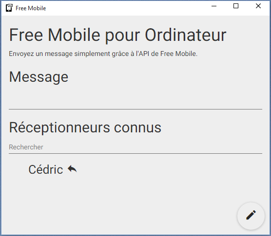

# Free Mobile pour Ordinateur

Ceci n'est pas une application officielle.

Une  application pour envoyer des SMS avec l'API de Free Mobile.



## Installation

1. [Télécharger](https://github.com/cedced19/free-mobile-desktop/releases/latest)
2. Extraire les fichiers
3. Exécuter `free-mobile.exe` (Windows) ou `free-mobile.app` (macOS)
4. [Obtenir les identifiants](http://www.domotique-info.fr/2014/06/nouvelle-api-sms-chez-free/)

## Pour compiler

### Prérequis
```
npm install -g gulp-cli
```

### Windows
```
npm install
gulp dist-win
```

### macOS
```
npm install
gulp dist-mac
```
ou si gulp n'est pas installé globalement :
```
npm install
npx gulp dist-mac
```

### Développement
```
npm install
gulp
```
